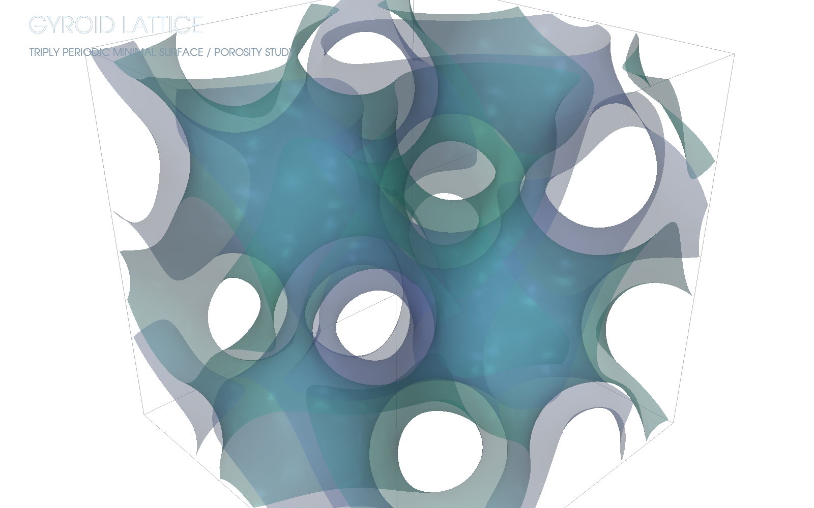
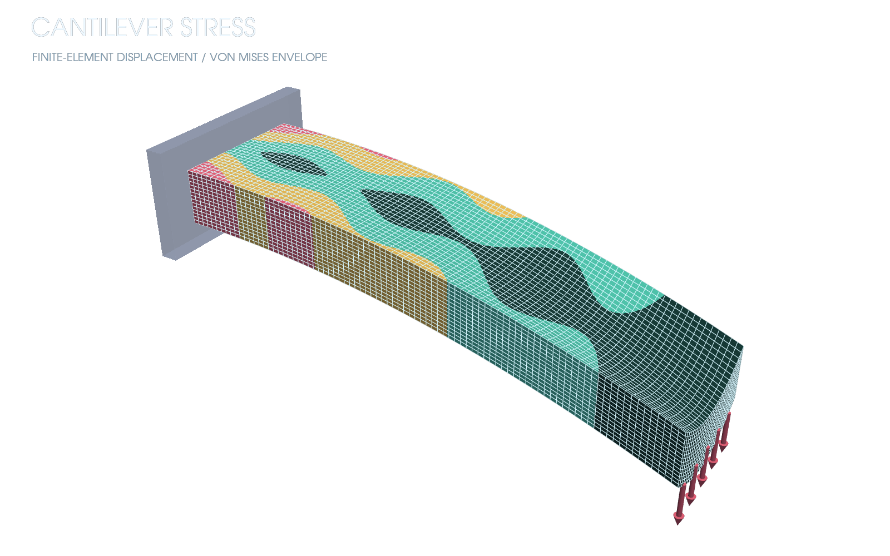
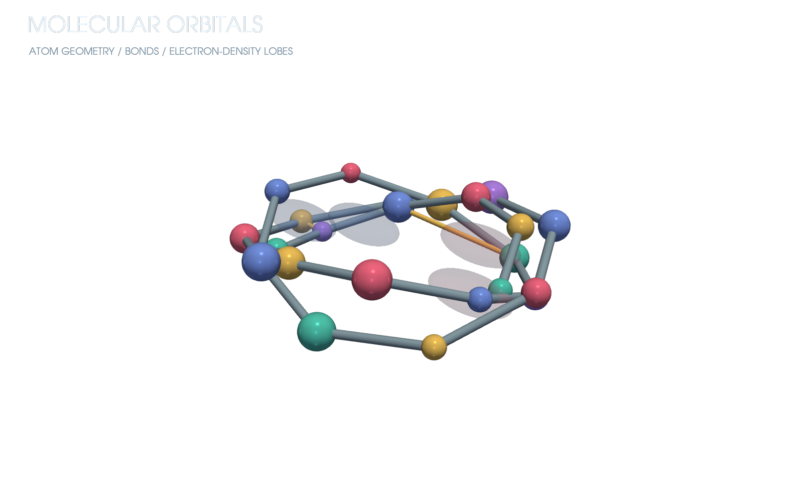
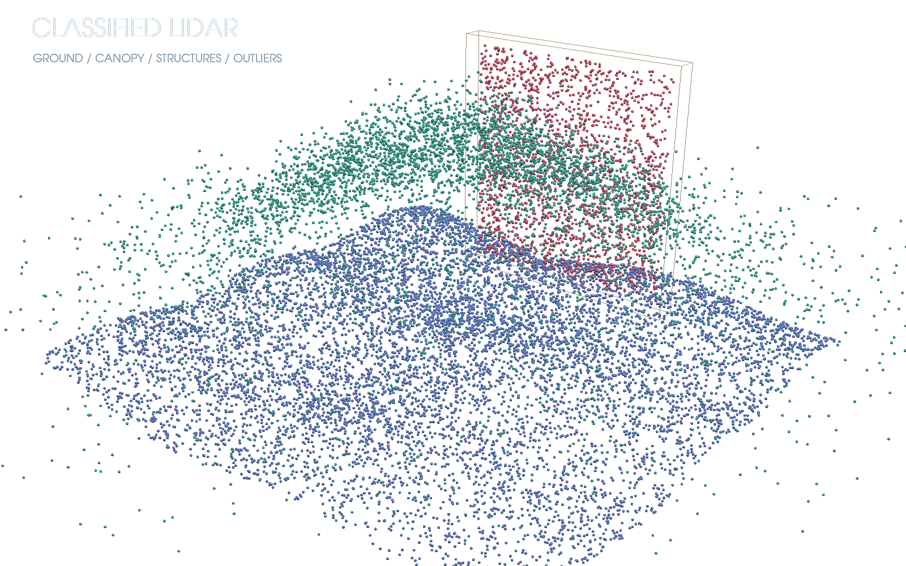
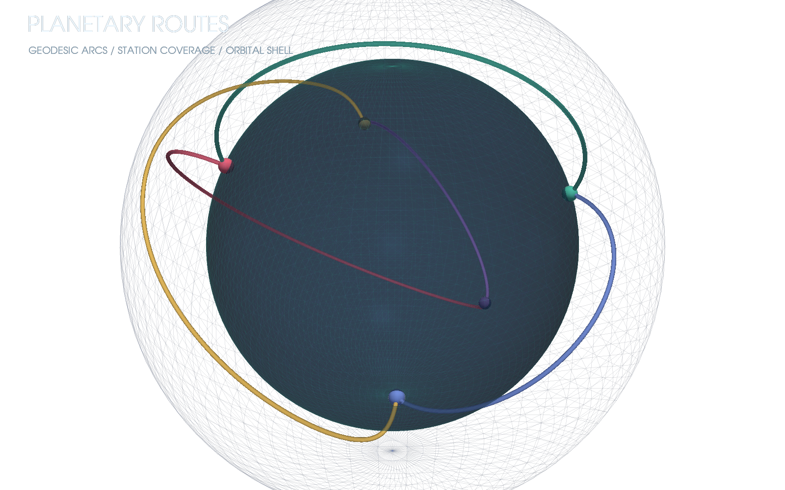
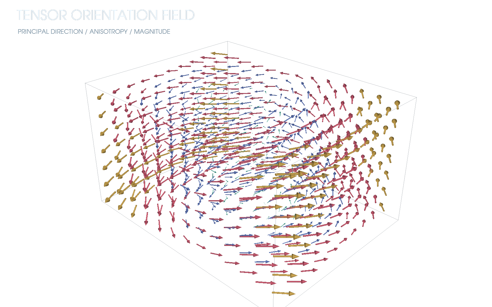
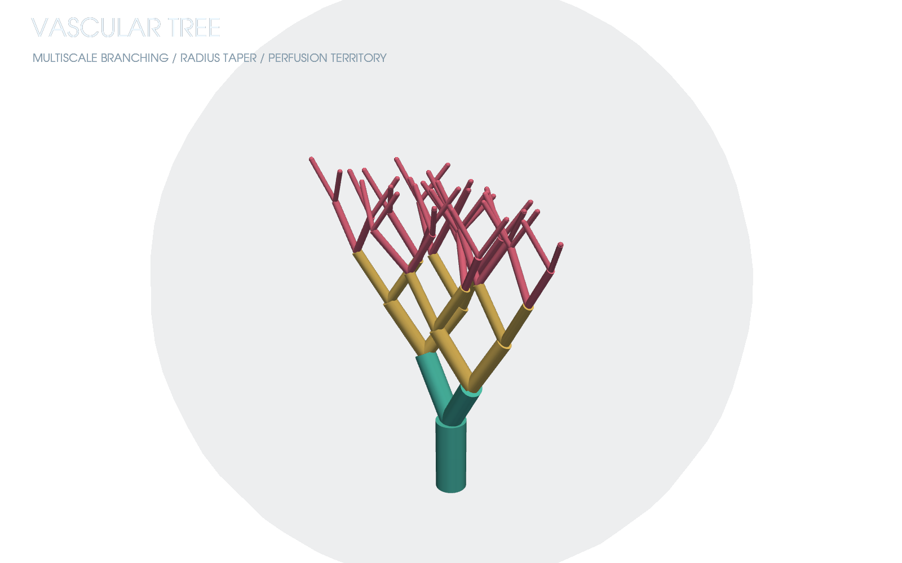
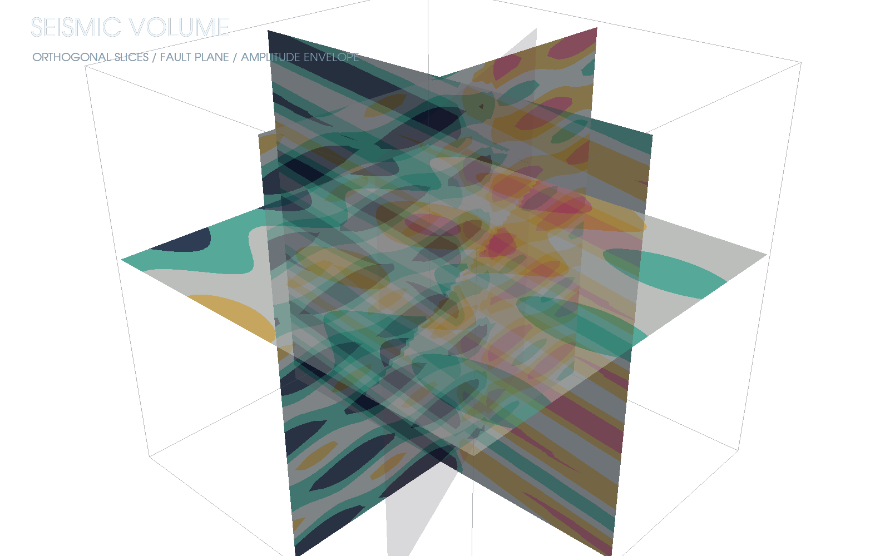
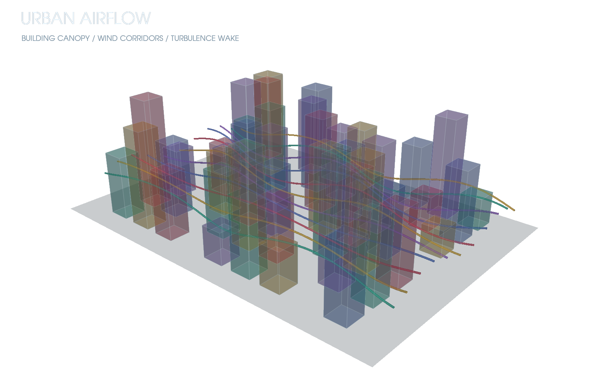

# PyVista Demos

Twelve scientific 3D reference scenes rendered off-screen through PyVista/VTK, with transparent PNG as the primary artifact.

`catalog.json` records the scientific use, question, visual family, complexity, and data/renderer tags.

| Terrain | Vortex | Waves | Gyroid |
|---|---|---|---|
|  |  |  |  |
| FEA stress | Molecular orbitals | Point cloud | Planetary routes |
|  |  |  |  |
| Tensor glyphs | Vascular tree | Seismic slices | Urban airflow |
|  |  |  |  |

```bash
uv sync
uv run render-pyvista-demos
uv run ruff check .
uv run pytest
```

The renderer uses fixed cameras and deterministic fields, requests VTK's transparent screenshot path, and validates alpha plus non-trivial chromatic content.
