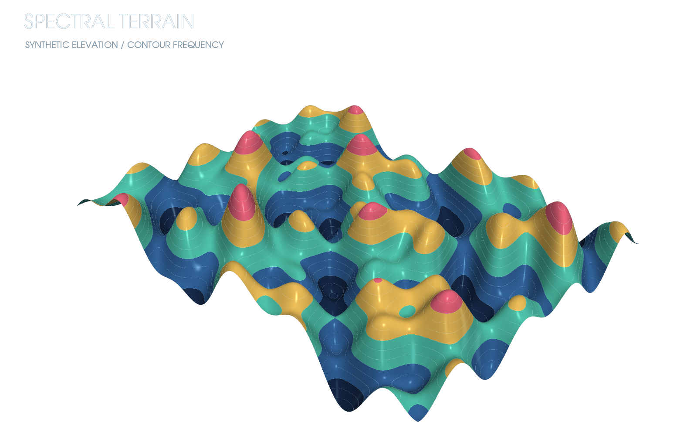
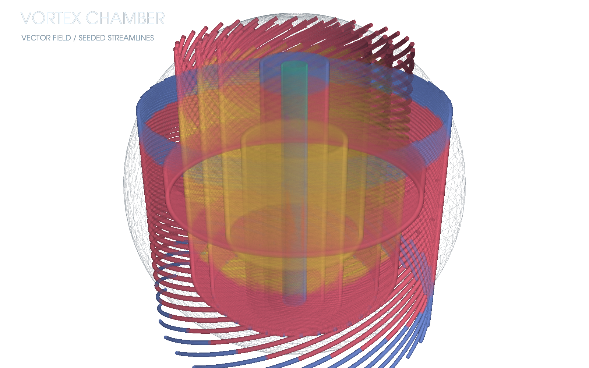
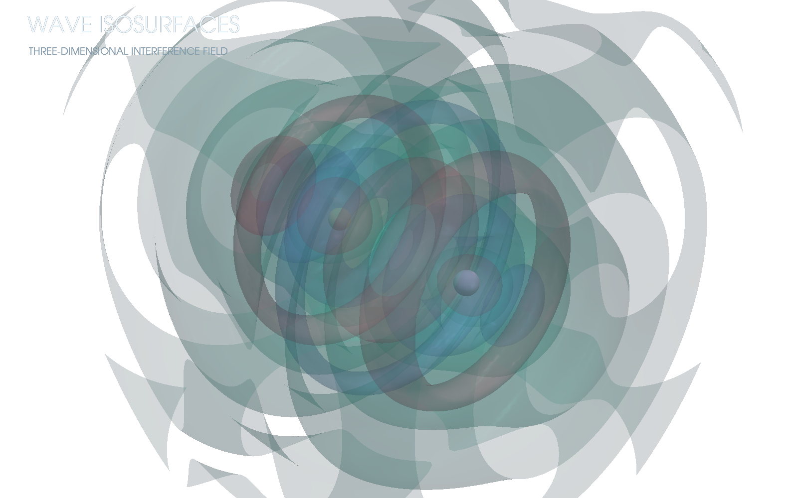

# PyVista Demos

Scientific 3D scenes rendered off-screen through PyVista/VTK, with transparent PNG as the primary artifact.

| Scene | Preview | Data primitive |
|---|---|---|
| Spectral terrain |  | Structured grid + contours |
| Vortex chamber |  | Vector field + stream tubes |
| Wave isosurfaces |  | Volumetric scalar field + contours |

```bash
uv sync
uv run render-pyvista-demos
uv run ruff check .
uv run pytest
```

The renderer uses fixed cameras and deterministic fields, requests VTK's transparent screenshot path, and validates alpha plus non-trivial chromatic content.
